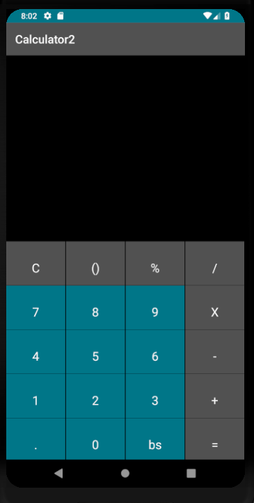

# Android-Calculator
## **A GUI based calculator for the android platform**

#### This is one of the projects that I worked on while learing Android development, it is written in Java. This calculator provides standard functionality. 

#### Features:
* Ability to clear the screen 
* Backspace 
* Brackets
* Decimal computing 

